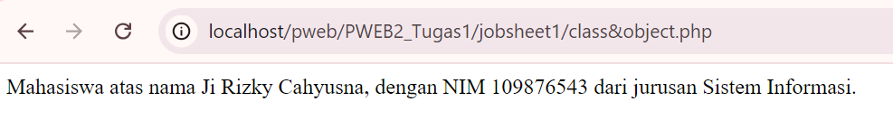
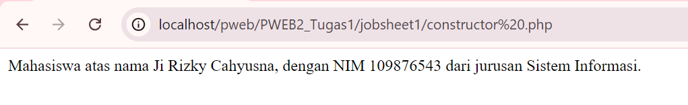
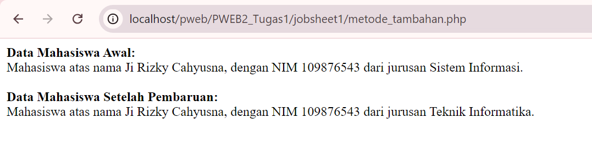
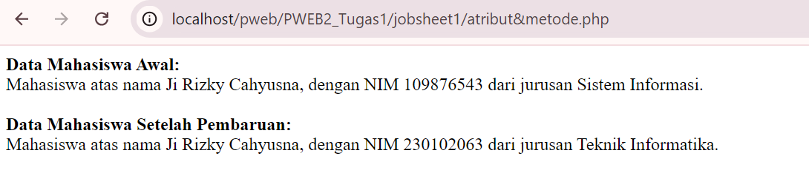
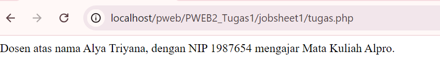
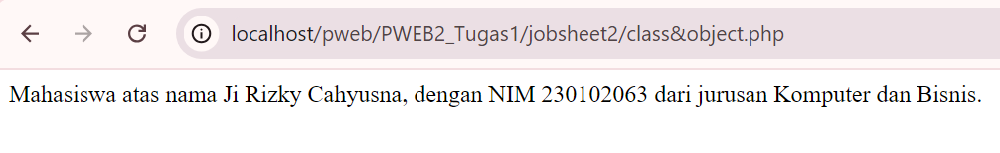
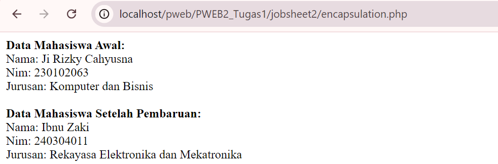
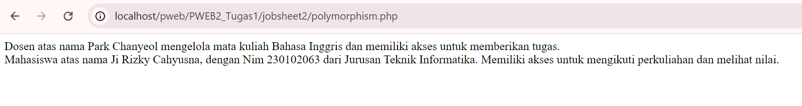

# PraktikumWEB2-Tugas 1

Object Oriented Programming (OOP) atau dalam bahasa Indonesia dikenal dengan Pemrograman  Berorientasi Objek (PBO) merupakan sebuah paradigman/ pendekatan pengembangan perangkat lunak/program yang memiliki struktur berbasis objek serta memiliki atribut dan method yang dapat berinteraksi satu sama lain untuk memenuhi suatu tujuan. 
### Materi Pokok
**Kelas, Objek, dan Constructor dalam PHP**
1. Kelas(Class) adalah cetak biru yang mendefinisikan atribut (data) dan metode (fungsi) yang dimiliki oleh objek.
2. Objek adalah instansi dari kelas yang memiliki nilai atribut dan dapat menjalankan metode yang didefinisikan dalam kelas.
3. Constructor adalah metode khusus yang dipanggil saat objek dibuat, digunakan untuk menginisialisasi atribut objek.

**Cara Membuat Class & Objek**
```php
<?php
// Definisi Kelas
class Mobil {
    // Atribut atau Properties
    public $merk;
    public $warna;
    // Constructor
    public function __construct($merk, $warna){
        $this->merk = $merk;
        $this->warna = $warna;
    }
    // Metode atau Function
    public function deskripsi() {
        return "Mobil ini adalah $this->merk bewarna $this->warna.";
    }
}
// Instansiasi Objek
$mobil1 = new Mobil("Toyota", "Hitam");
echo $mobil1->deskripsi();
?>
```
Penjelasan:
1. Class: Dalam contoh di atas, class Mobil mendefinisikan sebuah kelas bernama Mobil yang memiliki dua atribut yaitu merk dan warna. Kelas ini juga memiliki metode deskripsi yang akan menjelaskan informasi tentang mobil.
2. Objek: Pada baris $mobil1 = new Mobil("Toyota", "Hitam");,. Di sini, objek ini memiliki atribut merk yang diisi dengan "Toyota" dan atribut warna yang diisi dengan "Hitam".
3. Constructor: Metode __construct($merk, $warna) dalam kelas Mobil adalah constructor yang digunakan untuk mengatur nilai atribut merk dan warna saat objek baru dibuat.

**Atribut dan metode dalam PHP**

Atribut adalah variabel yang didefinisikan dalam sebuah kelas dan digunakan untuk menyimpan data atau status objek. Atribut dapat memiliki visibilitas yang berbeda, seperti public, protected, atau private.
- Public : Dapat diakses dari mana saja, baik dari dalam kelas maupun dari luar kelas.
- Protected: Hanya dapat diakses dari dalam kelas itu sendiri dan kelas yang diwarisi.
- Private: Hanya dapat diakses dari dalam kelas itu sendiri.

Metode adalah fungsi yang didefinisikan dalam sebuah kelas. Metode digunakan untuk melakukan tindakan atau operasi yang terkait dengan objek tersebut. Metode juga dapat memiliki visibilitas yang sama seperti atribut.

##  Jobsheet 1
### Instruksi Kerja
**1. Membuat Class & Objek**

Cara Membuat kelas, objek, dan metode di PHP
1. Definisi Kelas (Class):

Pada kelas Mahasiswa didefinisikan dengan tiga atribut publik: nama, nim, dan jurusan. Atribut ini akan menyimpan informasi terkait mahasiswa.
```php
<?php
// Definisi class Mahasiswa
class Mahasiswa {
    // Atribut publik yang menyimpan informasi mahasiswa
    public $nama;
    public $nim;
    public $jurusan;
```
2. Membuat Metode:

Metode tampilkanData() digunakan untuk menampilkan data dari atribut mahasiswa dalam bentuk string. Metode ini mengambil nilai dari atribut nama, nim, dan jurusan yang telah diisi sebelumnya.
```php
    // Metode untuk menampilkan data mahasiswa
    public function tampilkanData() {
        // Mengembalikan string yang berisi informasi mahasiswa
        return "Mahasiswa atas nama $this->nama, dengan NIM $this->nim dari jurusan $this->jurusan.";
    }
}
```
3. Instansiasi Objek:

Pada bagian ini, objek $mahasiswa1 dibuat dari kelas Mahasiswa. Setelah objek dibuat, nilai-nilai untuk nama, nim, dan jurusan diisi secara manual.
```php
// Membuat objek Mahasiswa
$mahasiswa1 = new Mahasiswa();
// Mengisi nilai atribut
$mahasiswa1->nama = "Ji Rizky Cahyusna";
$mahasiswa1->nim = "109876543";
$mahasiswa1->jurusan = "Sistem Informasi";
```
4. Mengakses Metode:

Menggunakan objek $mahasiswa1, kita memanggil metode tampilkanData() untuk menampilkan data mahasiswa yang telah diisi sebelumnya.
```php
echo $mahasiswa1->tampilkanData(); // Menampilkan data mahasiswa
?>
```
**Ouput yang dihasilkan:**


**2. Implementasi Constructor**

Cara membuat kelas menggunakan constructor, dan menginstansiasi objek di PHP. Kelas Mahasiswa mewakili informasi seorang mahasiswa, termasuk atribut seperti nama, NIM (Nomor Induk Mahasiswa), dan jurusan. ```__construct($nama, $nim, $jurusan)```:Metode ini digunakan untuk menginisialisasi atribut kelas dengan nilai awal yang diberikan saat objek diinstansiasi.
```php
// Constructor untuk menginisialisasi objek Mahasiswa 
    public function __construct($nama, $nim, $jurusan){
        // Inisialisasi atribut kelas dengan nilai yang diberikan pada saat pembuatan objek
        $this->nama = $nama;
        $this->nim = $nim;
        $this->jurusan = $jurusan;
    }
    // Metode untuk menampilkan data mahasiswa
    public function tampilkanData() {
        // Mengembalikan string yang berisi informasi mahasiswa
        return "Mahasiswa atas nama $this->nama, dengan NIM $this->nim dari jurusan $this->jurusan.";
    }
}
// Membuat objek mahasiswa baru dengan nama, NIM, dan jurusan awal
$mahasiswa1 = new Mahasiswa("Ji Rizky Cahyusna", "109876543", "Sistem Informasi");
echo $mahasiswa1->tampilkanData(); // Menampilkan data mahasiswa
?>
```
**Ouput yang dihasilkan:**


**3. Membuat Metode Tambahan**

Metode tambahan yaitu updateJurusan() digunakan untuk memperbarui nilai dari atribut jurusan dengan jurusan baru yang diberikan sebagai parameter.
```php
// Metode untuk menampilkan data mahasiswa
    public function tampilkanData() {
        // Mengembalikan string yang berisi informasi mahasiswa
        return "Mahasiswa atas nama $this->nama, dengan NIM  $this->nim dari jurusan $this->jurusan.";
    }
// Metode untuk memperbarui jurusan mahasiswa
    public function updateJurusan($jurusan_baru) {
        // Mengubah nilai atribut jurusan dengan jurusan yang baru
        $this->jurusan = $jurusan_baru;
    }
}
// Membuat objek mahasiswa baru dengan nama, NIM, dan jurusan awal
$mahasiswa1 = new Mahasiswa("Ji Rizky Cahyusna", "109876543", "Sistem Informasi");

// Tampilkan data mahasiswa awal
echo "<b>Data Mahasiswa Awal:</b><br>";
echo $mahasiswa1->tampilkanData() . "<br>"; // Menampilkan data mahasiswa awal yang belum diperbarui

// Mengubah jurusan menggunakan metode updateJurusan
$mahasiswa1->updateJurusan("Teknik Informatika");

// Tampilkan data mahasiswa yang sudah diperbarui
echo "<b><br>Data Mahasiswa Setelah Pembaruan:</b><br>";
echo $mahasiswa1->tampilkanData(); // Menampilkan data mahasiswa yang sudah diperbarui
?>
```
**Ouput yang dihasilkan:**


**4. Penggunaan Atribut dan Metode**

Proyek ini menggunakan kelas Mahasiswa dalam PHP untuk mendemonstrasikan untuk bisa membuat, memperbarui, dan menampilkan data mahasiswa menggunakan atribut dan metode (setter dan getter).Kode ini memungkinkan perubahan pada data seperti NIM dan jurusan setelah objek dibuat.

1. Definisi Kelas Mahasiswa,
Kelas Mahasiswa memiliki tiga atribut publik untuk menyimpan data mahasiswa:
```nama```untuk menyimpan Nama mahasiswa, 
```nim```untuk menyimpan Nomor Induk Mahasiswa, 
```jurusan``` untuk menyimpan Jurusan mahasiswa
```php
<?php
// Definisi Class Mahasiswa
class Mahasiswa {
    // Atribut publik yang menyimpan informasi mahasiswa
    public $nama;
    public $nim;
    public $jurusan;
```
2. Constructor digunakan untuk menginisialisasi atribut kelas dengan nilai awal yang diberikan saat objek diinstansiasi.
    
```php
    // Constructor untuk menginisialisasi objek Mahasiswa 
    public function __construct($nama, $nim, $jurusan){
        // Inisialisasi atribut kelas dengan nilai yang diberikan pada saat pembuatan objek
        $this->nama = $nama;
        $this->nim = $nim;
        $this->jurusan = $jurusan;
    }
```
3. Metode tampilkanData()
Metode ini menampilkan informasi lengkap mengenai mahasiswa dalam bentuk string.
```php
    // Metode untuk menampilkan data mahasiswa
    public function tampilkanData() {
        // Mengembalikan string yang berisi informasi mahasiswa
        return "Mahasiswa atas nama $this->nama, dengan NIM $this->nim dari jurusan $this->jurusan.";
    }
```
4. Metode update dan setter

updateJurusan($jurusan_baru): Mengubah jurusan mahasiswa.
setNIM($nim_baru): Mengubah NIM mahasiswa.
```php
    // Metode untuk memperbarui jurusan mahasiswa
    public function updateJurusan($jurusan_baru) {
        // Mengubah nilai atribut jurusan dengan jurusan yang baru
        $this->jurusan = $jurusan_baru;
    }
    // Metode untuk mengubah nilai NIM mahasiswa
    public function setNIM($nim_baru) {
         // Mengubah nilai atribut nim dengan nim yang baru
        $this->nim = $nim_baru;
    }
}
```
5. Instansiasi Objek dan Akses Metode

Objek Mahasiswa dibuat dan data awal ditampilkan. Setelah itu, metode update dan setter digunakan untuk memperbarui jurusan dan NIM.
```php
// Membuat objek mahasiswa baru dengan nama, NIM, dan jurusan awal
$mahasiswa1 = new Mahasiswa("Ji Rizky Cahyusna", "109876543", "Sistem Informasi");

// Tampilkan data mahasiswa awal
echo "<b>Data Mahasiswa Awal:</b><br>";
echo $mahasiswa1->tampilkanData() . "<br>"; // Menampilkan data mahasiswa awal yang belum diperbarui

// Mengubah jurusan menggunakan metode updateJurusan
$mahasiswa1->updateJurusan("Teknik Informatika");

// Mengubah NIM mahasiswa menggunakan metode setNIM
$mahasiswa1->setNIM("230102063");

// Tampilkan data mahasiswa yang sudah diperbarui
echo "<b><br>Data Mahasiswa Setelah Pembaruan:</b><br>";
echo $mahasiswa1->tampilkanData(); // Menampilkan data mahasiswa yang sudah diperbarui
?>
```
**Ouput yang dihasilkan:**


## Tugas Jobsheet 1
1. Implementasikan kelas Dosen dengan atribut nama, nip, dan mataKuliah. 
2. Buat metode tampilkanDosen() untuk menampilkan informasi dosen. 
3. Buat objek dari kelas Dosen, dan gunakan metode tampilkanDosen() untuk 
menampilkan informasi tersebut. 

Proyek ini mendemonstrasikan penerapan konsep pemrograman berorientasi objek (OOP) di PHP melalui pembuatan kelas Dosen. Kelas ini menyimpan informasi tentang dosen dan menyediakan metode untuk menampilkan data tersebut.

a. Definisi Kelas

Kelas Dosen didefinisikan menggunakan kata kunci class. Kelas ini bertanggung jawab untuk menyimpan dan mengelola informasi terkait dosen, seperti nama, NIP, dan mata kuliah.
```php
<?php
// Definisi Class Dosen
class Dosen {
    // Atribut publik yang menyimpan informasi Dosen
    public $nama;
    public $nip;
    public $mataKuliah;
```
2. Atribut
Kelas Dosen memiliki tiga atribut publik:

- ```public $nama``` Menyimpan nama dosen.
- ```public $nip```: Menyimpan Nomor Induk Pegawai dosen.
- ```public $mataKuliah```: Menyimpan mata kuliah yang diajarkan oleh dosen.
Atribut ini didefinisikan sebagai variabel publik yang memungkinkan akses langsung dari objek kelas.

3. Constructor

Constructor adalah metode khusus yang dipanggil secara otomatis ketika objek dibuat yaitu Metode __construct($nama, $nip, $mataKuliah) digunakan untuk menginisialisasi atribut kelas dengan nilai yang diberikan pada saat pembuatan objek. Misalnya, saat objek dosen1 dibuat, nama, nip, dan mata kuliah diisi dengan nilai yang diberikan.
```php
    // Constructor untuk menginisialisasi objek Dosen
    public function __construct($nama, $nip, $mataKuliah){
        // Inisialisasi atribut kelas dengan nilai yang diberikan pada saat pembuatan objek
        $this->nama = $nama;
        $this->nip = $nip;
        $this->mataKuliah = $mataKuliah;
    }
```
4. Metode dalam kelas Dosen 

Digunakan untuk melakukan operasi pada data atau mengembalikan informasi. Pada kelas ini,memiliki metode tampilkanDosen(). Ini memudahkan untuk menampilkan informasi dosen dengan cara yang terstruktur.
``` php  
    // Metode untuk menampilkan data Dosen
    public function tampilkanDosen() {
        // Mengembalikan string yang berisi informasi dosen
        return "Dosen atas nama $this->nama, dengan NIP $this->nip mengajar Mata Kuliah $this->mataKuliah.";
    }
}
```
5. Instansiasi Objek

Sebuah objek dari kelas Dosen dibuat dengan nama $dosen1, dan diinisialisasi dengan nama "Alya Triyana", NIP "1987654", dan mata kuliah "Alpro". Berikut adalah pembuatan objek dan pemanggilan metode. 
```php 
// Membuat objek dosen baru dengan nama, nip, Matakuliah 
$dosen1 = new Dosen ("Alya Triyana", "1987654", "Alpro");
```
6. Menampilkan Data

Menggunakan Metode tampilkanDosen() dipanggil untuk menampilkan informasi dosen yang telah diisi sebelumnya.
```php
echo $dosen1->tampilkanDosen();  // Menampilkan data dosen
?>
```
Berikut adalah coding secara keseluruhan yang telah dibuat:
```php
<?php
// Definisi Class Dosen
class Dosen {
    // Atribut publik yang menyimpan informasi Dosen
    public $nama;
    public $nip;
    public $mataKuliah;
    // Constructor untuk menginisialisasi objek Dosen
    public function __construct($nama, $nip, $mataKuliah){
        // Inisialisasi atribut kelas dengan nilai yang diberikan pada saat pembuatan objek
        $this->nama = $nama;
        $this->nip = $nip;
        $this->mataKuliah = $mataKuliah;
    }
    // Metode untuk menampilkan data Dosen
    public function tampilkanDosen() {
        // Mengembalikan string yang berisi informasi dosen
        return "Dosen atas nama $this->nama, dengan NIP $this->nip mengajar Mata Kuliah $this->mataKuliah.";
    }
}
// Membuat objek dosen baru dengan nama, nip, Matakuliah 
$dosen1 = new Dosen ("Alya Triyana", "1987654", "Alpro");
echo $dosen1->tampilkanDosen();  // Menampilkan data dosen
?>
```

**Output yang dihasilkan:**



# Jobsheet 2
### Materi Pokok
**Prinsip OOP ada empat prinsip utama, yaitu:**
1. Encapsulation (Enkapsulasi)<br>
Definisi: Enkapsulasi adalah proses menyembunyikan detail implementasi suatu objek dan hanya memperlihatkan antarmuka yang relevan. Data dan metode dibungkus dalam satu kesatuan (kelas) dan akses terhadap data dibatasi melalui akses tertentu (seperti public, private, protected).
2. Inheritance (Pewarisan)<br>
Definisi: Pewarisan memungkinkan sebuah kelas untuk mewarisi atribut dan metode dari kelas lain. Kelas yang mewarisi disebut subclass atau child class, sedangkan kelas yang diwarisi disebut superclass atau parent class.
3. Polymorphism (Polimorfisme)<br>
Definisi: Polimorfisme memungkinkan suatu metode atau fungsi memiliki nama yang sama, tetapi perilaku yang berbeda pada kelas yang berbeda. Polimorfisme terbagi menjadi overloading dan overriding.
Overriding: Subclass dapat mengubah implementasi metode yang ada di superclass.
Overloading: Metode yang memiliki nama sama tetapi jumlah atau tipe parameternya berbeda.
4. Abstraction (Abstraksi)<br>
Definisi: Abstraksi adalah proses menyembunyikan detail kompleks dari suatu sistem dan hanya menampilkan fungsionalitas yang penting. Abstraksi dapat dilakukan dengan menggunakan kelas abstrak atau interface.


### Instruksi Kerja
**1. Membuat Class dan Object**

o  Buat class Mahasiswa yang memiliki atribut nama, nim, dan jurusan.
```php
<?php
// Definisi Class Mahasiswa
class Mahasiswa {
    // Atribut publik yang menyimpan informasi mahasiswa
    public $nama;
    public $nim;
    public $jurusan;
```
Class: Kelas Mahasiswa didefinisikan dengan tiga atribut publik, yaitu $nama, $nim, dan $jurusan. Ketiga atribut ini digunakan untuk menyimpan informasi mengenai nama, NIM, dan jurusan mahasiswa.

o  Buat metode tampilkanData() dalam class Mahasiswa
```php
    // Metode untuk menampilkan data mahasiswa
    public function tampilkanData() {
        // Mengembalikan string yang berisi informasi mahasiswa
        return "Mahasiswa atas nama $this->nama, dengan NIM $this->nim dari jurusan $this->jurusan.";
    }
}
```
Metode tampilkanData(): Metode ini mengembalikan informasi mahasiswa dalam bentuk string. Properti kelas $nama, $nim, dan $jurusan dipanggil menggunakan $this-> untuk mengakses atribut dari objek yang dibuat.
o  Instansiasi objek dari class Mahasiswa dan tampilkan data mahasiswa tersebut
```php
// Membuat objek Mahasiswa
$mahasiswa1 = new Mahasiswa();
```
Instansiasi Objek: Objek bernama $mahasiswa1 dibuat menggunakan keyword new. Objek ini merupakan instansiasi dari class Mahasiswa.

```php
// Mengisi nilai atribut
$mahasiswa1->nama = "Ji Rizky Cahyusna";
$mahasiswa1->nim = "230102063";
$mahasiswa1->jurusan = "Komputer dan Bisnis";
```
Pemberian Nilai: Nilai untuk atribut $nama, $nim, dan $jurusan diberikan secara manual setelah objek $mahasiswa1 dibuat.
```php
echo $mahasiswa1->tampilkanData(); // Menampilkan data mahasiswa
?>
```
Memanggil Metode: Metode tampilkanData() dipanggil menggunakan objek $mahasiswa1 untuk menampilkan informasi mahasiswa yang sudah diisi.

Berikut adalah coding secara keseluruhan yang telah dibuat:
```php
<?php
// Definisi Class Mahasiswa
class Mahasiswa {
    // Atribut publik yang menyimpan informasi mahasiswa
    public $nama;
    public $nim;
    public $jurusan;
    // Metode untuk menampilkan data mahasiswa
    public function tampilkanData() {
        // Mengembalikan string yang berisi informasi mahasiswa
        return "Mahasiswa atas nama $this->nama, dengan NIM $this->nim dari jurusan $this->jurusan.";
    }
}
// Membuat objek Mahasiswa
$mahasiswa1 = new Mahasiswa();
// Mengisi nilai atribut
$mahasiswa1->nama = "Ji Rizky Cahyusna";
$mahasiswa1->nim = "230102063";
$mahasiswa1->jurusan = "Komputer dan Bisnis";
echo $mahasiswa1->tampilkanData(); // Menampilkan data mahasiswa
?>
```

**Output yang dihasilkan:**


**2. Encapsulation** 

1. Definisi Class Mahasiswa

o Ubah atribut dalam class Mahasiswa menjadi private. 
```php
<?php
// Definisi Class Mahasiswa
class Mahasiswa {
    // Atribut private yang menyimpan informasi mahasiswa
    private $nama;
    private $nim;
    private $jurusan;
```
Class Mahasiswa didefinisikan dengan atribut private. Atribut ini tidak dapat diakses secara langsung dari luar class. Atribut-atribut tersebut adalah:<br>
```$nama```: Menyimpan nama mahasiswa.
```$nim```: Menyimpan Nomor Induk Mahasiswa (NIM).
```$jurusan```: Menyimpan jurusan mahasiswa.

2. Constructor
```php
// Constructor untuk menginisialisasi objek Mahasiswa 
    public function __construct($nama, $nim, $jurusan) {
        // Inisialisasi atribut kelas dengan nilai yang diberikan pada saat pembuatan objek
        $this->nama = $nama;
        $this->nim = $nim;
        $this->jurusan = $jurusan;
    }
```
Constructor adalah metode yang dipanggil saat objek class diinisialisasi. Nilai dari $nama, $nim, dan $jurusan diisi saat objek dibuat, dengan menggunakan $this-> untuk menunjuk pada atribut dari objek yang sedang dibuat.

3. Metode Getter dan Setter

o  Buat metode getter dan setter untuk atribut nama, nim, dan jurusan.

o  Demonstrasikan akses ke atribut menggunakan metode getter dan setter.

Getter dan setter Untuk Nama
```php
// Metode Getter untuk mengambil nilai atribut nama
    public function getNama() {
        return $this->nama;
    }
    // Metode Setter untuk mengubah nilai atribut nama
    public function setNama($nama) {
        $this->nama = $nama;
    }
```
Mengambil dan mengubah nilai atribut $nama. 

Getter dan setter untuk Nim
```php
// Metode Getter untuk mengambil nilai atribut nim
    public function getNim() {
        return $this->nim;
    }
    // Metode Setter untuk mengubah nilai atribut nim
    public function setNim($nim) {
        $this->nim = $nim;
    }
```
Mengambil dan mengubah nilai dari atribut $nim.

Getter dan setter untuk Jurusan
```php
// Metode Getter untuk mengambil nilai atribut jurusan
    public function getJurusan() {
        return $this->jurusan;
    }
    // Metode Setter untuk mengubah nilai atribut jurusan
    public function setJurusan($jurusan) {
        $this->jurusan = $jurusan;
    }
}
```
Mengambil dan mengubah nilai dari atribut $jurusan

4. Instansiasi Objek
```php
// Membuat objek Mahasiswa baru dengan nama, nim, jurusan
$mahasiswa1 = new Mahasiswa("Ji Rizky Cahyusna", "230102063", "Komputer dan Bisnis");
```
Objek $mahasiswa1 dibuat dari class Mahasiswa dengan nilai nama, nim, dan jurusan yang diberikan langsung pada saat instansiasi.

5. Menampilkan Data Awal 
```php
// Tampilkan data mahasiswa awal
echo "<b>Data Mahasiswa Awal:<b><br>";
echo "Nama: " . $mahasiswa1->getNama() . "<br>"; 
echo "Nim: " . $mahasiswa1->getNim() . "<br>"; 
echo "Jurusan: " . $mahasiswa1->getJurusan() . "<br>"; 

```
Metode getter digunakan untuk menampilkan nilai awal dari nama, nim, dan jurusan.

6. Mengubah Data dengan Setter
```php
// Mengubah atribut nama, nim, dan jurusan menggunakan setter
$mahasiswa1->setNama("Ibnu Zaki");
$mahasiswa1->setNIM("240304011");
$mahasiswa1->setJurusan("Rekayasa Elektronika dan Mekatronika");
```
Nilai nama, nim, dan jurusan dari objek $mahasiswa1 diubah menggunakan metode setter.

7. Menampilkan Data Setelah Pembaruan
```php
// Tampilkan data mahasiswa yang sudah diperbarui
echo "<b><br>Data Mahasiswa Setelah Pembaruan:</b><br>";
echo "Nama: " . $mahasiswa1->getNama() . "<br>"; 
echo "Nim: " . $mahasiswa1->getNim() . "<br>"; 
echo "Jurusan: " . $mahasiswa1->getJurusan() . "<br>"; 
?>
```
Setelah nilai diubah, data mahasiswa yang telah diperbarui ditampilkan kembali dengan memanggil metode getter.

Berikut adalah coding secara keseluruhan yang telah dibuat:
```php
<?php
// Definisi Class Mahasiswa
class Mahasiswa {
    // Atribut private yang menyimpan informasi mahasiswa
    private $nama;
    private $nim;
    private $jurusan;
    // Constructor untuk menginisialisasi objek Mahasiswa 
    public function __construct($nama, $nim, $jurusan) {
        // Inisialisasi atribut kelas dengan nilai yang diberikan pada saat pembuatan objek
        $this->nama = $nama;
        $this->nim = $nim;
        $this->jurusan = $jurusan;
    }
    // Metode Getter untuk mengambil nilai atribut nama
    public function getNama() {
        return $this->nama;
    }
    // Metode Setter untuk mengubah nilai atribut nama
    public function setNama($nama) {
        $this->nama = $nama;
    }
    // Metode Getter untuk mengambil nilai atribut nim
    public function getNim() {
        return $this->nim;
    }
    // Metode Setter untuk mengubah nilai atribut nim
    public function setNim($nim) {
        $this->nim = $nim;
    }
    // Metode Getter untuk mengambil nilai atribut jurusan
    public function getJurusan() {
        return $this->jurusan;
    }
    // Metode Setter untuk mengubah nilai atribut jurusan
    public function setJurusan($jurusan) {
        $this->jurusan = $jurusan;
    }
}
// Membuat objek Mahasiswa baru dengan nama, nim, jurusan
$mahasiswa1 = new Mahasiswa("Ji Rizky Cahyusna", "230102063", "Komputer dan Bisnis");
// Tampilkan data mahasiswa awal
echo "<b>Data Mahasiswa Awal:</b><br>";
echo "Nama: " . $mahasiswa1->getNama() . "<br>"; 
echo "Nim: " . $mahasiswa1->getNim() . "<br>"; 
echo "Jurusan: " . $mahasiswa1->getJurusan() . "<br>"; 

// Mengubah atribut nama, nim, dan jurusan menggunakan setter
$mahasiswa1->setNama("Ibnu Zaki");
$mahasiswa1->setNIM("240304011");
$mahasiswa1->setJurusan("Rekayasa Elektronika dan Mekatronika");
// Tampilkan data mahasiswa yang sudah diperbarui
echo "<b><br>Data Mahasiswa Setelah Pembaruan:</b><br>";
echo "Nama: " . $mahasiswa1->getNama() . "<br>"; 
echo "Nim: " . $mahasiswa1->getNim() . "<br>"; 
echo "Jurusan: " . $mahasiswa1->getJurusan() . "<br>"; 
?> 
```

**Output yang dihasilkan:**


**3. Inheritance**

o Buat class Pengguna dengan atribut nama dan metode getNama(). 

1. Definisi Class Pengguna (Induk)
```php
<?php
// Definisi Class Pengguna, class induk
class Pengguna {
    // Atribut protected, hanya dapat diakses oleh class ini dan turunan 
    protected $nama;
    // Constructor untuk menginisialisasi atribut
    public function __construct($nama) {
        $this->nama = $nama;
    }
    // Metode getter untuk mengembalikan nilai atribut nama
    public function getNama() {
        return $this->nama;
    }
}
```
- Class Pengguna merupakan class induk (parent class) dengan satu atribut protected bernama $nama. Atribut protected berarti bahwa variabel ini hanya bisa diakses oleh class ini atau oleh class yang mewarisinya.
- Constructor pada class ini menerima satu parameter, yaitu $nama, dan menginisialisasi atribut $nama.
- Getter getNama() digunakan untuk mengembalikan nilai dari atribut $nama.

2. Definisi Class Dosen (Subclass)

o Buat class Dosen yang mewarisi class Pengguna dan tambahkan atribut 
mataKuliah. 
```php
// Definisi Class Dosen, subclass yang mewarisi dari class Pengguna
class Dosen Extends Pengguna {
    private $mataKuliah;  // Atribut private, hanya dapat diakses dalam class Dosen
    // Constructor class Dosen, memanggil constructor dari class Pengguna
    public function __construct($nama, $mataKuliah) {
        parent::__construct($nama);
        $this->mataKuliah = $mataKuliah; // Inisialisasi mata kuliah dosen
    }
    // Metode getter untuk mengembalikan nilai atribut mataKuliah
    public function getMataKuliah() {
        return $this->mataKuliah;
    }
}
```

- Class Dosen merupakan class turunan (subclass) dari Pengguna. Dengan keyword extends, class ini mewarisi semua atribut dan metode dari class Pengguna.
- Atribut $mataKuliah didefinisikan sebagai private, sehingga hanya dapat diakses dari dalam class Dosen.
- Constructor pada class Dosen menerima dua parameter, yaitu $nama dan $mataKuliah. Constructor ini menggunakan parent::__construct($nama) untuk memanggil constructor dari class Pengguna dan mewarisi inisialisasi atribut $nama.
- Getter getMataKuliah() digunakan untuk mengembalikan nilai dari atribut $mataKuliah.

3. Membuat Objek dari Class Dosen

o Instansiasi objek dari class Dosen dan tampilkan data dosen. 
```php
// Membuat objek baru dari class Dosen
$dosen1 = new Dosen("Park Chanyeol", "Bahasa Inggris");
```
Membuat objek baru $dosen1 dari class Dosen. Constructor dari class Dosen diinisialisasi dengan dua parameter: nama "Park Chanyeol" dan mata kuliah "Bahasa Inggris".
Atribut $nama akan diinisialisasi oleh class Pengguna, dan atribut $mataKuliah diinisialisasi oleh class Dosen.

4. Menggunakan Metode Getter untuk Menampilkan Data
```php
// Menampilkan nama dosen dengan memanggil metode getNama dari class Pengguna
echo $dosen1->getNama(). "<br>"; // Output: Park Chanyeol
// Menampilkan mata kuliah dosen dengan memanggil metode getMataKuliah dari class Dosen
echo $dosen1->getMataKuliah(); // Output: Bahasa Inggris
?>
```
- Pertama, menggunakan metode getNama() dari class Pengguna (yang diwarisi oleh Dosen) untuk menampilkan nama dosen
- Kemudian, metode getMataKuliah() dari class Dosen dipanggil untuk menampilkan mata kuliah yang diajar oleh dosen tersebut.

Berikut adalah coding secara keseluruhan yang telah dibuat:
```php
<?php
// Definisi Class Pengguna, class induk
class Pengguna {
    // Atribut protected, hanya dapat diakses oleh class ini dan turunan 
    protected $nama;
    // Constructor untuk menginisialisasi atribut
    public function __construct($nama) {
        $this->nama = $nama;
    }
    // Metode getter untuk mengembalikan nilai atribut nama
    public function getNama() {
        return $this->nama;
    }
}
// Definisi Class Dosen, subclass yang mewarisi dari class Pengguna
class Dosen Extends Pengguna {
    private $mataKuliah;  // Atribut private, hanya dapat diakses dalam class Dosen
    // Constructor class Dosen, memanggil constructor dari class Pengguna
    public function __construct($nama, $mataKuliah) {
        parent::__construct($nama);
        $this->mataKuliah = $mataKuliah; // Inisialisasi mata kuliah dosen
    }
    // Metode getter untuk mengembalikan nilai atribut mataKuliah
    public function getMataKuliah() {
        return $this->mataKuliah;
    }
}
// Membuat objek baru dari class Dosen
$dosen1 = new Dosen("Park Chanyeol", "Bahasa Inggris");
// Menampilkan nama dosen dengan memanggil metode getNama dari class Pengguna
echo $dosen1->getNama(). "<br>"; // Output: Park Chanyeol
// Menampilkan mata kuliah dosen dengan memanggil metode getMataKuliah dari class Dosen
echo $dosen1->getMataKuliah(); // Output: Bahasa Inggris
?>
```
**Output yang dihasilkan:**


**4. Polymorphism**
1. Definisi Class Pengguna (Induk)

o Buat class abstrak Pengguna dengan metode abstrak aksesFitur(). 
```php
<?php
// Definisi Class Pengguna, class induk
class Pengguna {
    // Atribut protected, hanya dapat diakses oleh class ini dan turunan 
    protected $nama;
    // Constructor untuk menginisialisasi atribut
    public function __construct($nama) {
        $this->nama = $nama;
    }

    // Metode aksesFitur yang akan di-override oleh subclass
    public function aksesFitur() {
        return "Pengguna".$this->nama."mempunyai akses fitur.";
    }
}
```
- Class Pengguna adalah class induk yang memiliki atribut protected bernama $nama. Atribut protected dapat diakses oleh class ini dan class yang mewarisinya.
- Constructor dari class ini menerima parameter $nama dan menginisialisasi atribut $nama.
- aksesFitur() adalah metode yang mengembalikan string untuk menunjukkan bahwa pengguna memiliki akses fitur. Metode ini akan di-override oleh subclass.

2. Definisi Class Dosen (Subclass)

o Implementasikan aksesFitur() dengan cara berbeda di class Dosen dan Mahasiswa. 
```php
// Definisi Class Dosen, subclass yang mewarisi dari class Pengguna
class Dosen extends Pengguna {
    private $mataKuliah;  // Atribut private, hanya dapat diakses dalam class Dosen
    
    // Constructor class Dosen, memanggil constructor dari class Pengguna
    public function __construct($nama, $mataKuliah) {
        parent::__construct($nama);
        $this->mataKuliah = $mataKuliah; // Inisialisasi mata kuliah dosen
    }

    // Mengoverride metode aksesFitur khusus untuk dosen
    public function aksesFitur() {
        return "Dosen atas nama " . $this->nama . " mengelola mata kuliah " . $this->mataKuliah . 
               " dan memiliki akses untuk memberikan tugas.<br>";
    }
}
```
- Class Dosen adalah subclass yang mewarisi dari Pengguna. Selain atribut $nama yang diwarisi, class ini memiliki atribut private $mataKuliah, yang menyimpan mata kuliah yang diampu dosen.
- Constructor menerima dua parameter ($nama dan $mataKuliah) dan memanggil constructor dari class induk dengan parent::__construct($nama). Ini menginisialisasi nama dosen, sedangkan $mataKuliah diinisialisasi dalam class Dosen.
- Metode aksesFitur() di-override dari class induk. Dalam class Dosen, metode ini mengembalikan string yang menjelaskan mata kuliah yang diajarkan dosen dan akses untuk memberikan tugas.

3. Definisi Class Mahasiswa (Subclass)

o Implementasikan aksesFitur() dengan cara berbeda di class Dosen dan Mahasiswa. 
```php
// Definisi Class Mahasiswa, subclass yang mewarisi dari class Pengguna
class Mahasiswa extends Pengguna {
    // Atribut private, hanya dapat diakses dalam class Mahasiswa
    private $nim;
    private $jurusan;  

    // Constructor class Mahasiswa, memanggil constructor dari class Pengguna
    public function __construct($nama, $nim, $jurusan) {
        parent::__construct($nama);
        $this->nim = $nim; // Inisialisasi nim mahasiswa
        $this->jurusan = $jurusan; // Inisialisasi jurusan mahasiswa
    }

    // Mengoverride metode aksesFitur khusus untuk mahasiswa
    public function aksesFitur() {
        return "Mahasiswa atas nama " . $this->nama . ", dengan Nim " . $this->nim . " dari Jurusan " . $this->jurusan . 
        ". Memiliki akses untuk mengikuti perkuliahan dan melihat nilai.";
    }
}
```
- Class Mahasiswa juga merupakan subclass dari Pengguna dan menambahkan atribut $nim dan $jurusan sebagai atribut khusus mahasiswa.
- Constructor menerima tiga parameter ($nama, $nim, dan $jurusan). Constructor ini juga memanggil constructor induk dengan parent::__construct($nama) untuk menginisialisasi nama mahasiswa.
- Metode aksesFitur() di-override untuk mengembalikan informasi tentang akses mahasiswa, yang berbeda dari akses dosen. Mahasiswa memiliki akses untuk mengikuti perkuliahan dan melihat nilai.

4. Membuat Objek 
o Instansiasi objek dari class Dosen dan Mahasiswa, lalu panggil metode aksesFitur(). 
```php
// Membuat objek baru dari class Dosen dan Mahasiswa
$dosen1 = new Dosen("Park Chanyeol", "Bahasa Inggris");
$mahasiswa1 = new Mahasiswa("Ji Rizky Cahyusna", "230102063", "Teknik Informatika");
```
membuat dua objek: satu dari class Dosen dan satu dari class Mahasiswa.
- $dosen1 adalah objek dosen bernama Park Chanyeol yang mengajar mata kuliah Bahasa Inggris.
- $mahasiswa1 adalah objek mahasiswa bernama Ji Rizky Cahyusna dengan NIM 230102063 dan jurusan Teknik Informatika.

5. Menampilkan Data
```php
// Menampilkan akses fitur untuk dosen
echo $dosen1->aksesFitur(); 
// Menampilkan akses fitur untuk mahasiswa
echo $mahasiswa1->aksesFitur();
?>
```
aksesFitur() dipanggil untuk masing-masing objek, dan karena metode ini di-override dalam class turunan, ia akan mengembalikan informasi yang spesifik sesuai peran dosen atau mahasiswa.

Berikut adalah coding secara keseluruhan yang telah dibuat:
```php
<?php
// Definisi Class Pengguna, class induk
class Pengguna {
    // Atribut protected, hanya dapat diakses oleh class ini dan turunan 
    protected $nama;
    // Constructor untuk menginisialisasi atribut
    public function __construct($nama) {
        $this->nama = $nama;
    }

    // Metode aksesFitur yang akan di-override oleh subclass
    public function aksesFitur() {
        return "Pengguna".$this->nama."mempunyai akses fitur.";
    }
}

// Definisi Class Dosen, subclass yang mewarisi dari class Pengguna
class Dosen extends Pengguna {
    private $mataKuliah;  // Atribut private, hanya dapat diakses dalam class Dosen
    
    // Constructor class Dosen, memanggil constructor dari class Pengguna
    public function __construct($nama, $mataKuliah) {
        parent::__construct($nama);
        $this->mataKuliah = $mataKuliah; // Inisialisasi mata kuliah dosen
    }

    // Mengoverride metode aksesFitur khusus untuk dosen
    public function aksesFitur() {
        return "Dosen atas nama " . $this->nama . " mengelola mata kuliah " . $this->mataKuliah . 
               " dan memiliki akses untuk memberikan tugas.<br>";
    }
}

// Definisi Class Mahasiswa, subclass yang mewarisi dari class Pengguna
class Mahasiswa extends Pengguna {
    // Atribut private, hanya dapat diakses dalam class Mahasiswa
    private $nim;
    private $jurusan;  

    // Constructor class Mahasiswa, memanggil constructor dari class Pengguna
    public function __construct($nama, $nim, $jurusan) {
        parent::__construct($nama);
        $this->nim = $nim; // Inisialisasi nim mahasiswa
        $this->jurusan = $jurusan; // Inisialisasi jurusan mahasiswa
    }

    // Mengoverride metode aksesFitur khusus untuk mahasiswa
    public function aksesFitur() {
        return "Mahasiswa atas nama " . $this->nama . ", dengan Nim " . $this->nim . " dari Jurusan " . $this->jurusan . 
        ". Memiliki akses untuk mengikuti perkuliahan dan melihat nilai.";
    }
}

// Membuat objek baru dari class Dosen dan Mahasiswa
$dosen1 = new Dosen("Park Chanyeol", "Bahasa Inggris");
$mahasiswa1 = new Mahasiswa("Ji Rizky Cahyusna", "230102063", "Teknik Informatika");

// Menampilkan akses fitur untuk dosen
echo $dosen1->aksesFitur(); 
// Menampilkan akses fitur untuk mahasiswa
echo $mahasiswa1->aksesFitur();
?>
```
**Output yang dihasilkan:**


**5. Abstraction**

1. Definisi Class Pengguna (Class Abstrak)

o Buat class abstrak Pengguna dengan metode abstrak aksesFitur(). 
```php
<?php
// Definisi Class Pengguna, class induk (abstrak)
abstract class Pengguna {
    // Atribut protected, hanya dapat diakses oleh class ini dan turunan 
    protected $nama;

    // Constructor untuk menginisialisasi atribut
    public function __construct($nama) {
        $this->nama = $nama;
    }

    // Metode aksesFitur yang merupakan metode abstrak
    abstract function aksesFitur();
}
```
- Class Pengguna adalah class abstrak, yang artinya tidak dapat diinstansiasi langsung menjadi objek.
- Atribut $nama bersifat protected, sehingga hanya bisa diakses oleh class ini dan class yang mewarisinya.
- Constructor menerima satu parameter $nama, yang digunakan untuk menginisialisasi atribut $nama.
- Terdapat metode abstrak aksesFitur(), yang harus diimplementasikan oleh setiap class turunan. Ini memberikan fleksibilitas bagi subclass untuk memberikan implementasi spesifik terkait fitur yang mereka miliki.

2. Definisi Class Dosen (Subclass dari Pengguna)
o Implementasikan class Mahasiswa dan Dosen yang mengimplementasikan metode abstrak tersebut.
Class Dosen adalah subclass yang mewarisi dari class Pengguna.
Atribut tambahan $mataKuliah digunakan untuk menyimpan mata kuliah yang diampu oleh dosen. Ini adalah atribut private, sehingga hanya bisa diakses dari dalam class Dosen.
Constructor class Dosen menerima dua parameter ($nama dan $mataKuliah) dan memanggil constructor dari class induk menggunakan parent::__construct($nama) untuk menginisialisasi $nama.
Metode aksesFitur() di-override untuk memberikan implementasi spesifik bagi dosen, yaitu menunjukkan bahwa dosen dapat mengelola mata kuliah dan memiliki akses untuk memberikan tugas.
